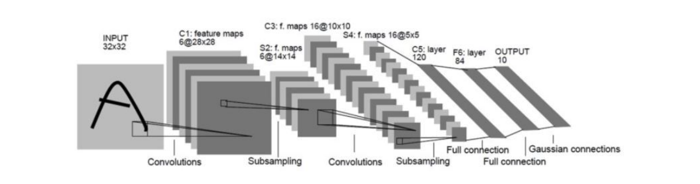
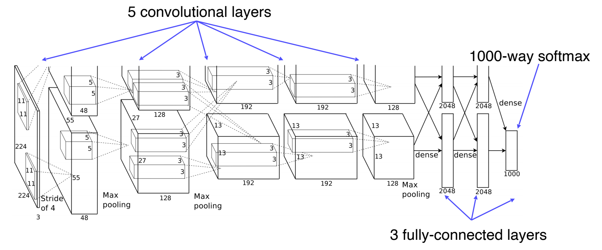

## Image Classification 1

#### 1. Course Overview

1. Why is visual perception important?
   - AI
     - 사고하고 인과관계를 분석하는 것과 함께 **시각**, 음성 등을 이해하는 것을 포함
   - AI의 Reference는 "인간"
     - 지각능력의 획득이 매우 중요
   - 지각 능력
     - 입력과 출력
     - 상호작용
     - multi-modal association
   - 시각 정보가 가장 큰 영향을 끼침
2. What is computer vision?
   - `Visual World` - `Sensing device` - `Interpreting device` - `Interpretation`
   - CV는 사람의 시각 인지에 대한 이해와 이를 적용하는 것 까지 포함
   - 인간에게서 보이는 불완전한 인지에 대한 이해도 중요
   - 고전 Machine Learning에서 Feature extraction과 Classification을 직접 하던 것이
     Deep Learning으로 넘어오며 자동화 됨
3. What you will learn in this course
   - 간단한 기술부터 trend에 맞는 방향의 기술
   - Multi-modal learning

#### 2.  Image classification

1. What is classification?
   - Classifier
     - mapping
2. An ideal approach for image recognition
   - 모든 대상이 정보에 들어있을 때
     - k-NN(k Nearest Neighbors)
     - query정보가 들어왔을 때 주변 정보를 불러와 유사도가 높은 label로 반환
     - 데이터가 많아질수록 필요한 시간과 메모리 등 시스템 복잡도가 커짐
     - 모든 데이터를 가지고 있는 것도 어려움
     - 영상 간의 유사도에 대한 정의가 필요
     - 현실적으로 사용되는 neural network들은 데이터를 추출해 적용시키는 것
3. Convolutional Neural Networks (CNN)
   - Single Layer, Fully Connected Layer
     - 데이터 변형에 취약하고 출력 변환이 어려움
   - Locally Connected Neural Networks
   - Local feature learning
   - parameter sharing
   - 다양한 CV task에서 backbone network로 사용

#### 3. CNN architectures for image classification 1

1. History

   

   - simple CNN architecture(1998)

2. AlexNet
   
   
   2012년 ILSVRC 1위를 차지한 Network
   
   - 총 8개의 layer
     - Conv - Pool - LRN - Conv - Pool - LRN - Conv - Conv - Conv - Pool - FC - FC - FC
     - 기존 2개만 사용되던 Conv layer가 5개로 증가
     - fully-connected layer 3개
     - LRN을 이용한 normalization layer
       - LRN(local response normalization)
         - lateral inhibition(측면 억제)을 시행하는 normalization
         - 부분적으로 명암을 조절하는 역할
           - ReLU로 인해 Conv나 pooling 과정에서 매우 높은 하나의 픽셀이 주변 낮은 픽셀 값에 주는 영향을 줄이기 위함
             - 낮은 픽셀들이 전달되지 않는 현상을 막기 위함
           - 다른 Activation map의 같은 위치에 있는 픽셀끼리 정규화하는 기법
           - 현재에는 잘 쓰이지 않고 대신 batch normalization이 쓰임
   - 개발 당시에는 GPU 메모리가 충분하지 않아(?) 2개의 GPU를 사용하였음
     - 논문에서는 각 GPU에 색상 이외의 정보를 학습 또는 색상 관련 정보를 학습하도록 함
   - Overlapping pooling
     - 바탕이 된 LeNet-5의 경우 average polling했으나 AlexNet은 max pooling 사용
       - `MaxPool`에서 `Linear`(tensor → vector)
         - `flatten`
         - Average Pooling: `AvgPool`
         - 두 방법은 Dimension 차이
       - overfit을 방지
   - 큰 filter size도 요즘은 쓰이지 않으나 당시에는 11x11 filter를 사용하였음
   - Receptive field
     - activation에서 한 element가 출력됐을 때 의존성 있는 입력 pixel의 영역
     - dependency가 있는 영역
     - input layer 수준까지 내려감
     - pooling layer size, kernel size
   - dropout
     - over-fitting을 막기 위해 사용
   - augmentation
     - generating image translation
     - horizontal reflection
   
3. VGGNet 
   
   - 깊은 구조
     
     
     [^VGG16 architecture]: https://neurohive.io/en/popular-networks/vgg16/
     
     - 16, 19 layer
     - 3x3 conv, 2x2 pooling
     - 모든 conv layer에서 3x3 filter를 사용하여 
     
   - 높은 성능을 가지고 있으면서 일반화가 잘 됨
   
   - 기본적으로 AlexNet 구조를 유지함
     - 224 x 224 image input
     - 평균 RGB값을 추출함
   
   - 작은 kernel size
     - 깊이가 깊어지면 큰 receptive field사이즈를 얻을 수 있음
     - parameter 수가 줄어듦
     - 크기가 커지면 고려되는 input의 크기가 커지는 이점이 있으나 3x3 conv를 2번 사용하는 것과 5x5 한 번 사용하는 것이
       receptive field를 받는 관점에서 같으며 parameter수가 크게 차이남
       - 즉, 같은 receptive field를 만드는 관점에서 작은 filter를 사용하는 것이 유리하여 이후 큰 filter를 사용하지 않게 되었음
   
   - 3 fully-connected layers
