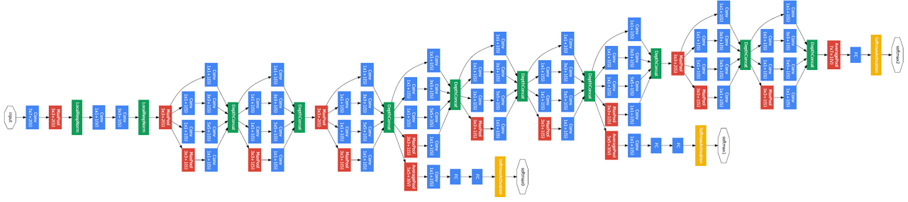

# Image Classification 2

#### 1. Problems with deeper layers

1.  Going deeper with convolutions
   - AlexNet에서 VGGnet으로 넘어오며 깊이가 깊어질수록 성능 향상할 것으로 기대함
     - 더 큰 receptive fields를 가짐
   - 정말 깊을수록 더 나은 결과를 보이는가?
     - 일반적으론 yes, but..
2.  Hard to optimize
   - Gradient vanishing / exploding 발생
   - Computationally complex
     - 메모리 초과 등의 문제
   - Overfitting에 취약 → Degradation 문제로 판별

#### 2. CNN architectures for image classification 2

1.  GoogLeNet
   
   - Overall
     - Stem network
     - Stacked inception module
       - vanishing gradient 문제가 흔히 발생
         - Auxiliary classifiers
         - 중간 결과로부터 task를 수행하기 위함
     - Classifier output: a single Softmax score
   - Inception module
     - 하나의 layer에 다양한 크기의 필터를 적용
     - depth가 아닌 width를 확장시킴
   - 1x1 convolution
     - dimension을 줄여 memory size 개선
     - filter vector와 feature vector를 내적
     - 공간 크기는 변하지 않지만, filter 개수로 채널 개수를 변경
   - Auxiliary classifier
     - 1x1 Conv 하나와 두 개의 FC layer
     - 학습 중에만 사용
2. ResNet
   - 최초로 100개 이상의 적층 layer를 사용
   - ImageNet에서 처음으로 인간 수준을 넘어섬
   - Network의 depth가 성능에 매우 중요한 것을 확인
   - Overall
     - 7x7 Conv layer
     - He initialization
       - identity connection으로 더해지는 값을 고려한 initialization 방법
     - stack residual blocks
       - 모든 block은 3x3 conv layer
         - 상대적으로 빠른 연산
     - Convolution Block이 나뉘어짐
       - 한 block을 넘어갈 때마다 공간해상도는 절반, channel 수는 두 배로 증가
     - a single FC layer 최종출력
   - Degradation problem
     - 처음에는 layer가 증가할수록 parameter수가 많아지며 overfitting 문제가 발생할 것이라 여김
       - training error가 더 많이 발생하며 deradation 과정 최적화에 문제가 있을 것으로 추정
   - Hypothesis
     - layer가 쌓이면 input과 output 사이의 관계를 바로 학습하기에 어려움이 존재
     - identity 외에 나머지 부분을 학습하여 학습 부담을 해소하고자 함
       - H(x) = F(x) + x 형태로 분할정복
     - shortcut connection
       - gradient vanishing 해소
   - residual connection
     - input / output path가 2ⁿ개 형성되며 굉장히 많은 경우를 고려함
3.  Beyond ResNet
   - DenseNet
     - dense block에서는 channel axis를 따라  layer를 concatenation
   - SENet
     - activation 간의 관계가 명확해질 수 있도록 channel간의 관계를 모델링하고 중요도를 파악
     - Squeeze
     - Excitation
   - EfficientNet
     - depth , width, resolution scaling을 적절하게 조절하여 saturation 한계 극복
   - Deformable convolution
     - 사람, 동물 등 일부분이 움직이는 등의 동작을 가진 개체 인지를 위함
     - deformable한 shape을 따라 convolution

#### 3. Summary of image classification

1. Summary of image classification
   - AlexNet
     - simple CNN architecture
     - simple computation, heavy memory size
     - low accuracy
   - VGGNet
     - simple 3x3 convolution
     - highest memory, heaviest computation
   - GoogLeNet
     - inception module
     - auxiliary classifier
     - 적절한 computation과 memory
     - 효율적이지만 복잡한 구조
2. CNN backbones
   - ResNet과 VGGNet이 간단하면서도 효율적으로 구현이 가능함
