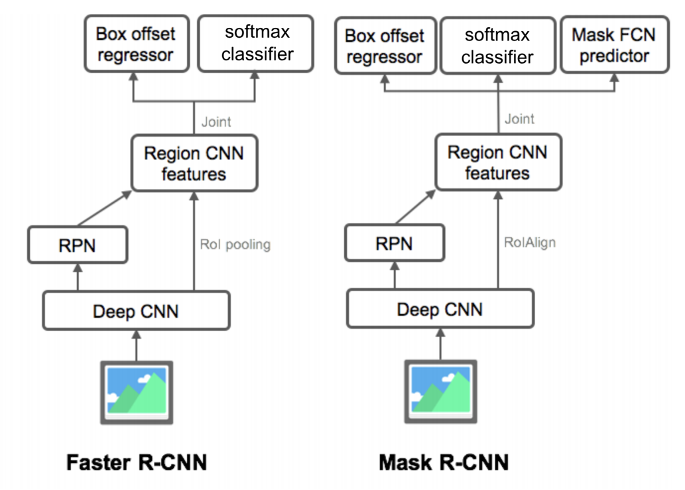
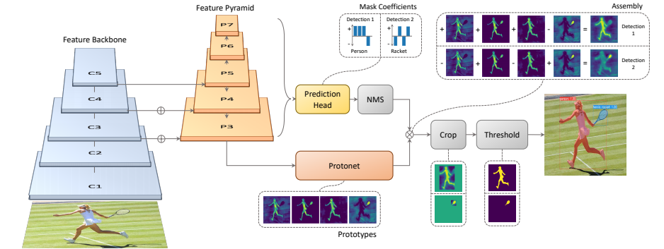
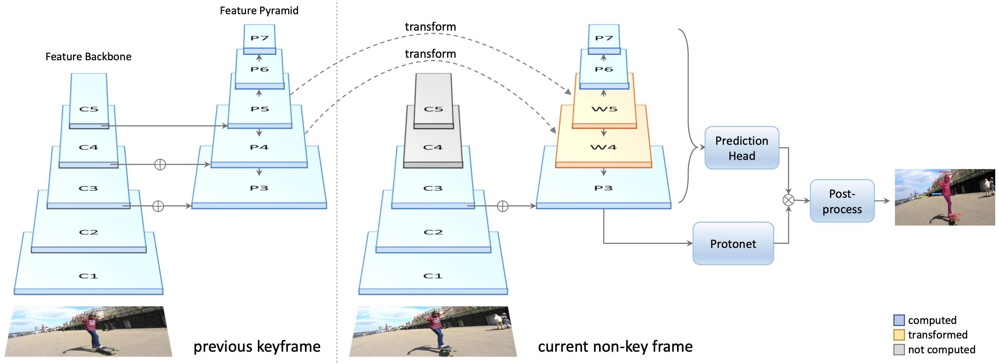
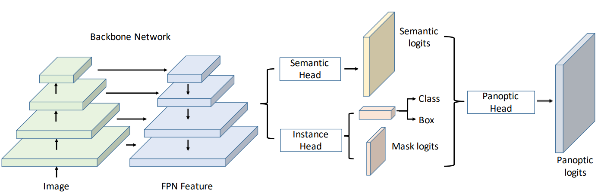
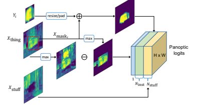
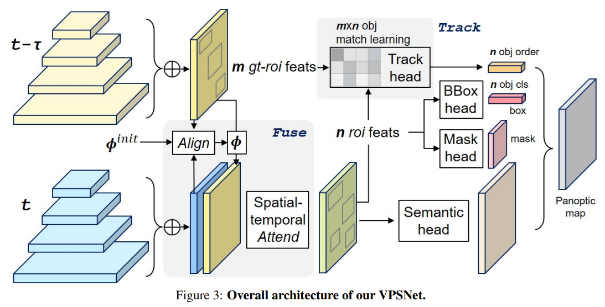

# Instance/Panoptic Segmentation and Landmark Localization

#### 1.  Instance segmentation

1.  What is instance segmentation?
   - semantic segmentation에서 진보된 segmentation
   - 같은 class의 다른 객체를 구분할 수 있는 기법
   - object detection을 기반으로 한 경우가 많음

2.  Instance segmenters
   - Mask-RCNN
     - Faster R-CNN + Mask branch
     - ROIAlign을 통한 정교한 pooling
     - 하나의 bbox에 대해 mask를 형성해 class 참조
     - 2stage 구조

   

   - YOLACT(You Only Look At CoeffcienTs)
     
     - single stage network
     - mask의 prototype을 추출하여 사용
       - mask를 합성해낼 수 있는 기본적인 여러 물체의 soft segmentation components
     - Prediction head에서 각 detection에 대해 prototype을 잘 합성하기 위한 계수 출력
     - 선형 결합하여 crop
     - Mask R-CNN과 달리 적은 prototype 개수의 선형결합으로  detection
   - YolactEdge
     
     - 소형화된 모바일 시스템에서 사용할 수 있도록 확장된 기법

#### 2. Panoptic segmentation

1.  What is panoptic segmentation?
   - 배경정보와 instace segmentation을 합친 기법
   
2. UPSNet & VPSNet
   - UPSNet
     
   
     - FPN구조를 사용해 고해상도의 feature map 추출
     - head를 두 부분으로 나눔
     - Semantic head
       - fully convolution 구조로 semantic map prediction
     - Instance head
       - 물체의 detection
       - box regression
       - mask logit 추출
   
     
   
     - 배경을 나타내는 mask response 별도의 작업 없음
     - 물체 부분을 masking한 response는 instance response와 더해짐
     - instance로 사용된 부분을 제외하여 배경 정보를 unknown 설정
   
   - VPSNet
     
   
     - panoptic segmentation을 video로 확장한 구조
     - 두 영상 사이의 Φ 라는 motion map을 사용해 각 프레임에서 나온 feature map을 warping
       - 각 pixel에 대해 이동한 대응점을 tracking
       - 원래 각 프레임 t에서 찍힌 feature와 warping된 feature를 비교해 detection
     - VPN을 통해 ROI feature 추출 및  track head를 통해 기존 ROI들과 현재 ROI 사이의 관계 매칭
       - 같은 물체가 같은 ID를 가질 수 있도록 만듦

#### 3. Landmark localization

1. What is landmark localization?
   - 얼굴 또는 사람의 pose를 추정하고 tracking
   - land mark(=key point)를 정의해 추적하는 task
   
2. Coordinate regression vs heatmap classification
   - coordinate regression이 일반적으로 부정확하고 편향됨
   
   - semantic segmentation처럼 한 채널이 각 key point 및 하나의 class로 생각하여 발생할 확률을   heatmap으로 표시한 classification
   
   - 성능이 좋아지긴 하지만, 계산량이 많은 단점
   
   - Landmark location to Gaussian heatmap
     $$
     G_\sigma(x,y)\space=\space exp(-\frac{(x-x_c)^2+(y-y_c)^2}{2\sigma^2})
     $$
   
     - x 축과 y축을 더해 broad casting으로 2차원 map 형성
   
3. Hourglass network

4. Extensions

   All pose → 3D model

   - DensePose
     - Mask R-CNN과 유사
     - Faster R-CNN + 3D surface regression branch
   - UV map
     - 표준 3D 모델의 각 부위를 2D로 펼친 좌표 표기법
   - Retinal  Face
     - Multi-task branch

#### 4. Detecting objects as keypoints

1. CornerNet & CenterNet
   - CornerNet
     - top-left, bottom-right → bouding box
   - CenterNet
     1. top-left, bottom-right, center → bouding box
     2. width, height, center → bouding box

