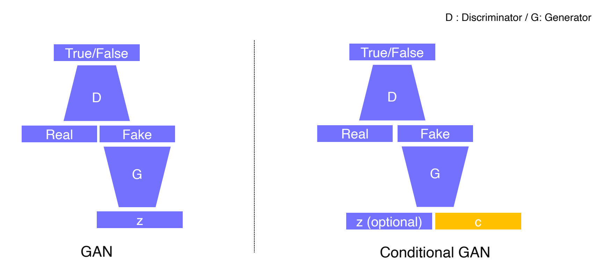
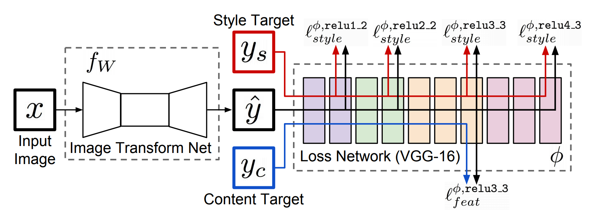

# Conditional Generative Model

#### 1.  Conditional generative model

1. Conditional generative model

   - sketch와 같은 condition이 주어진 상태에서 x가 그려질 확률
   - 기존의 generative model은 조작이 불가능한 random sample
   - 저화질의 영상, 저음질의 음성을 고화질, 고음질로 출력하는 model 등 

   

2. Conditional GAN and image translation
   - Image Style transfer, super resolution, colorization

3.  Example: Super resolution
   - low resolution → high resolution
     $$
     MAE = \frac{1}{n}\sum^n_{i=1}|y_i-\hat{y}_i|
     $$

     $$
     MSE = \frac{1}{n}\sum^n_{i=1}(y_i-\hat{y}_i)^2
     $$

   > y hat: ground truth          y: output

   - Loss
     - L1 loss는 검은색 이미지와 흰색 이미지를 입력하면 회색이 나옴
     - GAN을 활용할 경우 회색 이미지는 REAL로 판별하지 않음

#### 2. Image translation GANs

한 image를 다른 image로 변환하는 GAN

1.  Pix2Pix
   - Loss
     $$
     G^* = arg\space min\space max \mathcal{L}_{cGAN}(G, D) + \lambda \mathcal{L}_L1(G)
     $$
   
     - L1 loss를 사용하면 blurry한 결과 출력
     - GAN loss는 구조가 변한 결과
     - 두 loss를 함께 사용하면 구조를 유지한 형태의 결과가 출력
   
2. CycleGAN
   - pix2pix에서 대응관계 없는 set을 활용할 방안을 고려한 기법
   
   - non-pairwise dataset들의 domain간의 translation을 가능하게 한 기법
   
   - loss
   
     - CycleGAN loss = GAN loss + Cycle-consistency loss
   
     $$
     L_{GAN}(X→Y) + L_{GAM}{(Y → X)} + L_{cyicle}(G, D)
     $$
   
     - 방향성이 존재
     - Image와 translation 결과 사이에 상호 교환이 가능한 loss
   
   - Mode Collapse
   
     - GAN loss만 사용할 경우 input에 상관 없이 같은 output을 갖는 문제 발생
     - 이를 해결하기 위해 cycle-consistency loss가 도입
     - X와 Y가 상호 교류될 수 있도록하는 loss
   
2. Perceptual loss
   - High quality output을 얻기 위한 loss
   
     - Discriminator와 Generator가 균형을 맞춤
     - GAN loss는 pre-trained model이 필요하지 않음
       - data dependency
   
   - GAN loss에서 겪는 학습의 어려움을 개선한 loss
   
     - pre-trained network가 필요한 것이 흠
   
   - Image Transform Net
     
   
     - input image를 정해진 하나의 스타일로 transform
     - Loss Network
       - pre-trained된 Network(VGG 등)에서 feature만 추출해서 fix하여 사용
       - ImageNet만 학습
   
   - Feature reconstruction loss
   
     - input x에서 도출된 y hat이 우리의 의도대로 transform되기 위해 VGG를 사용해 feature 추출
       - loss measure → backpropagation → function f 학습
       - 이 때, transformed image가 content를 그대로 유지하고 있는 지 확인해주는 loss
     - content target
       - 스타일이 바뀌지 않은 원래의 x를 입력으로 넣어주는 것이 일반적
       - 일반 x와 transform된 x에서 feature를 뽑아 비교하여 loss measure
     - y로 변환되더라도 class를 보존해주는 loss
   
   - Style reconstruction loss
   
     - style을 transfer하기 위한 loss
     - 원하는 타입의 이미지를 target으로 입력 → transformed image와 함께 feature 추출
   
   - Gram matrices
   
     > *별도의 키워드로 찾아볼 것
   
     - feature map의 공간적인 특징없이 통계적인 특징을 담으려 디자인 됨
     - 이미지 전반에 걸친 통계적 특성을 담으려 함
     - 두 feature맵의 공간정보를 없애기 위해 pooling하여 C x H x W 형태로 reshape
       두 행렬을 곱해 생기는 C x C metrices

#### 3. Various GAN applications

1. Deepfake
   - 얼굴과 목소리를 만들어낼 수 있음
   - 보통 악영향이 많이 발생
   - Deepfake Detection Challenge
2. Face de-identification
   - password를 통해서 original 얼굴로 표현될 수 있도록 만듦
3. Video translation
   - pose transfer
   - video to video translation
   - game
