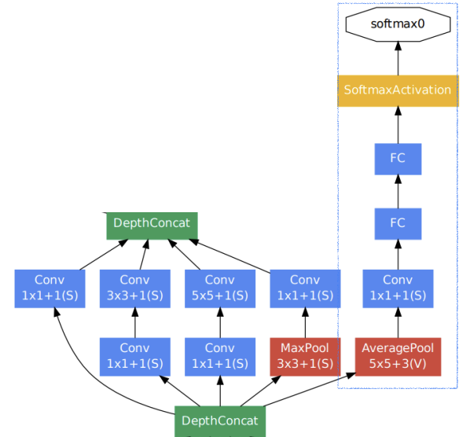
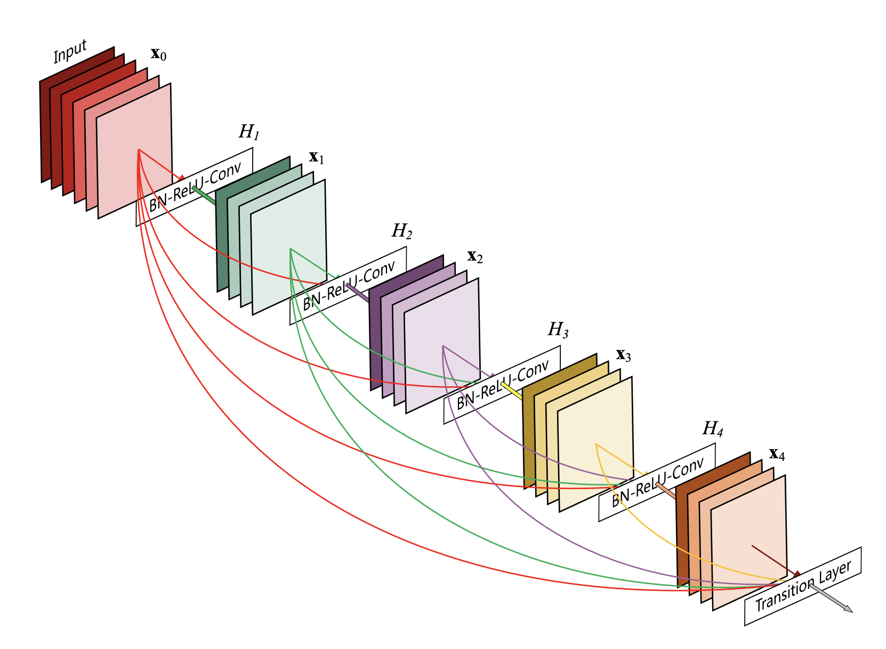
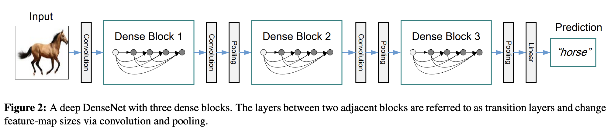

## Deeper layer 문제

→ Gradient Vanishing / exploding

→ 계산복잡도 증가

→ degradation problem (훈련 정확도의 퇴화)
  

## GoogLeNet

> **②** **Inception module 구조 제안**
> 

하나의 레이어에 Convolution filter들을 사용해서 여러 측면으로 activation 관찰 (depthX → 수평확장)

→ 물론 한층에 여러 필터를 사용하므로 계산복잡도 증가 

|

따라서, 1x1 convolution 적용 (1x1 convolution을 이용해 channel의 차원 줄임) (in ‘bottleneck layers’)

→ 계산복잡도 감소

> **위의 1x1 convolution의 구현 방식**
> 

= 필터 개수만큼 출력 channel 생성 

→ 1x1 convolution 적용 후, 공간크기는 변하지 X. 각 pixcel에 독립적으로 channel수 바꿔줌

> **Inception module을 사용한 GooLeNet의 ‘전체구조’**
> 

③ classifier : 깊은layer로 인해 output으로부터의 back-propagation gradient가 중간에 사라지는 문제발생
                       (gradient vanishing)
→ 중간에 classifier를 둬서, 중간에 loss 계산해 back-propagation 하도록하여 아래까지 gradient를 보냄

> **③** **Auxilliary classifier에 대하여 더 자세히**
> 
- vanishing gradient problem 해결
- low layer 까지의 gradient 도달
- train에서만 사용하고, test에서는 해당 부분 제거
    

  
## ResNet

> 최초로 100개가 넘게 layer를 쌓아도 성능이 높아진 첫 논문 
최초로 인간 레벨 성능을 뛰어넘어 imageNet 대회 1등
Image Classification 문제뿐아니라 localization, detection, segmentation 문제 모두 1등 
CVPR best paper award 수상
> 

깊게 쌓으려는 노력들은 있었음. 왜 이전에는 깊게 쌓아도 성능을 올리지 못했을까. 

**→ Degradation problem**

deeper layer가 될수록 Overfitting(train😀 test😡)이 될것이라 예상 

하지만, 실험 결과 Degradation(train😡 test😡)이 됨. 즉, 최적화가 잘 안됨

> **shortcut connection  제안**
> 
- “Residual block”  F(x)+x
    

shortcut(=skip) connection을 통해 gradient vanishing 문제를 해결 
    
- Resudual connection 의 성능이 좋은 이유
    

    
층을 쌓으면 쌓을수록 경로의 경우의 수($2^n$)가 많아짐  

> **shortcut connection을 사용한 ResNet의 ‘전체구조’**
> 
    

    
1. **7x7 convolution , He initialization**

    일반적인 initialization을 적용하면 게속해서 더해지는 x값이 너무 큼 

    → ResNet에 적합한 initialization 사용해야함 = He initialization 
        

        
2. **stack residual block, 3x3 convolution**

    3x3 convolution filter를 사용하여, 연산량(파라미터수)이 크게 늘어나지 X 

    이미지의 색별로 블럭 나눠져 있음, 한 단계를 넘어 갈때마다 공간해상도/2 (stride 2)→ 채널수*2

3. **single FC layer**

    output

    
## Beyond ResNets _ DenseNet

> Resdual 블록: skip connection을 통해서 전달된 x(identity) mapping을 더함 & 직전 블록의 정보 받음Dense 블록: channel 축으로 concatenation을 하도록 함 & 직전 블록/훨씬 이전 블록의 정보도 넘겨받음
> 
- resdual 블록에서의 **+** vs. Dense 블록에서의 **concatenation**
+ 연산: 두 신호를 합침
concatenation 연산: (channel은 늘어나지만) 신호가 보존되어있음. 따라서 하위 정보 이용시 용이
    

    

