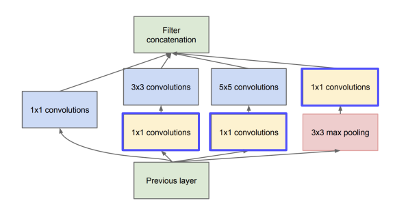
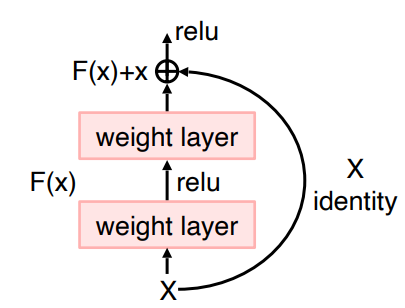

***
### AlexNet
* CNN으로 구성된 Network
* 시작부분에 11 x 11의 큰 convolution Layer를 사용했다

### VGGNet
* 여러장의 3 x 3의 convolution Layer와 2 x 2 MaxPooling을 사용하였다
* 여러장의 3 x 3의 convolution Layer를 사용하면서 다음과 같은 advantage를 얻었다
  * 큰 convolution Layer와 동일한 연산을 더 작은 Parameter로 수행할 수 있다
  * receptive field를 크게 유지할 수 있다
  * 더 깊게 비선형적으로 Layer 추가가 가능해 진다

### GoogLeNet
* 1 x 1, 3 x 3, 5 x 5, maxpooling을 이용하여 inception module을 구성하였다
* 1 x 1 convolution Layer를 이용해서 Channel 수를 줄여주었다  

* Layer가 깊어지면서 Gradient Vanashing이 일어나는것을 막기위해 Auxiliary classifier를 두어서 추가적으로 Gradient를 더해주었다
  * inference시에는 사용되지 않는다

### ResNet
* Skip Conncetion을 두어 Gradient Vanashing을 해결하여 더 많게 레이어를 쌓은 모델이다
* VGGnet의 3x3을 차용하여 파라미터 수를 크게 늘리지 않으면서 레이어를 더 쌓았다
* channel이 변하는 구간에서는 DownSampling을 통하여 channel과 Height, weight를 맞춰주었다

### reference
* [Naver Connect Boostcamp - ai tech](https://boostcamp.connect.or.kr/program_ai.html)
